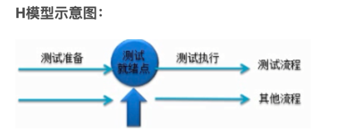
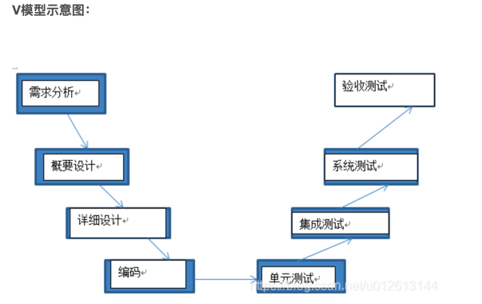
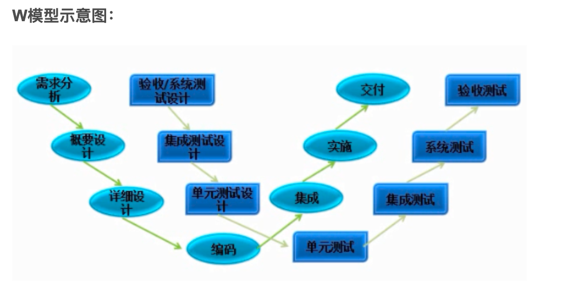

- 白盒测试方法论
    - 代码覆盖率
        - 概念
            * 语句覆盖
            * 判定覆盖
            * 评定覆盖
            * 条件组合覆盖
            * 分支覆盖--控制流中的每条边
            * 路径覆盖
            * 指令覆盖-- 一行代码编译为多条指令
            * 方法覆盖
            * 类覆盖
        - 工具
            * jacoco
            * emma
            * cobertura
    - 精准化测试
        - 概念
            * 代码调用链与黑盒测试用例关联
            * 根据代码变更自动分析影响范围
            * 黑盒测试过程中借助代码流程覆盖数据指导探索式测试
            * 利用线上数据推导有效测试用例
            * 代码流程分析与覆盖率统计
- 测试技术体系
    - UI测试
    - 单元测试
        - 单元测试框架
            * Java
                 * Junit
                 * TestNG
            * Python
                * unittest
                * pytest
    - 分层测试体系
        - 自动化分层测试体系
            * 70%单元测试
            * 20%服务测试
            * 10%用户界面测试
    - 接口测试
        - 接口测试方法
            * Charles\Fiddler
            * postman
            * Jmeter
            * loadTunner
            * python:Request\HttpRunner
            * Java :HttpClient\RestAssured
- 测试流程体系
    - 测试用例
    - 测试右移
        - 介绍
            * 往发布之后移
            * 产品上线后进行线上监控
        - 线上监控
            * 闭环的线上问题反馈-检查-解决-更新流程
            * 更便捷的日志查看回传
            * 丰富的log便于排查问题定位
            * 丰富的监控指标--业务异常点指标
            * 业务监控---短信发送
            * 关键指标每日监控---服务器指标
            * 生产数据监控 ---警报
    - 测试左移
        - 测试左移介绍
            * 往测试之前的开发阶段移
            * 测试团队在软件开发周期早期介入
            * 对代码进行测试
            * 从发现bug到预发bug
        - 测试左移手段
            * 代码评审---人工
            * 代码审计---自动化
            * 单元测试
            * 自动化冒烟测试
            * 研发自测
    - 软件测试对象
        - 软件测试对象
            * 需求文档、接口文档
            * 源代码
            * 软件程序
    - 软件测试模型
        - H模型
        

            - 优缺点
                * 优点：
                    * 软件测试完全独立，与其它流程并发
                    * 软件测试活动可以尽早准备，尽早执行，具有很强的灵活性
                * 缺点：
                    * 测试就绪点分析困难
                    * 对整个项目组的人员要求非常高
                    
        - V模型
        

            - V模型优缺点
            * 优点
                * 既有底层的测试又有高层测试
                * 讲开发阶段清楚的表现出来，便于控制开发过程
            * 缺点
                * 容易让人误解为测试是在开发完成之后的一个阶段
                * 由于顺序性，进入测试流程发现bug不容易找到其根源，并且代码修改起来困难
                * 如果需求变更较大，导致重复变更需求设、设计、编码、测试，返工量大

        - W模型
        

            - W模型优缺点
                * 反应开发和测试并行的关系
                * 优点
                    * 测试贯穿到整个软件的生命周期中，且除了代码，需求、设计都需要测试
                    * 更早的介入到软件开发中，能今早的发现缺陷进行修复
                    * 测试与开发并行
                * 缺点：
                    * 无法支持迭代的开发模型
                    * 有些项目开发过程中没有文档，无法使用W模型
                    * 对于需求和设计的测试技术要求很高，实践起来困难
    - 软件测试原则
        - 软件测试原则
            * 测试显示缺陷的存在
            * 穷尽测试是不可能的
            * 测试尽早介入
            * 缺陷集群性（2/8原则）
            * 杀虫剂悖论 --- 一个测试用例不能哪来执行多次(相同测试数据)
            * 测试活动依赖于测试内容
            * 没有错误是好是谬论
- 常用测试平台
    - 测试用例平台
        * jira
        * redmine 适合小客户
        * testlink 体验不太好
        * 其它：tapd，云效，禅道
        * 无协作模式
    - 持续集成平台
        * Jinkens
        * gitlab runner
        * gitlab action
        * 自建DevOps平台  
- 黑盒测试方法
    - 常用测试方法
        - 等价类
            * 输入域明确：把程序输入域划分若干子集
            * 常见分类：有效、无效等价类
        - 边界值
            * 根据经验大多数错误来自于对边界值的处理不严谨
            * 边界值是对等价类的补充
        - 因果图与判定表
            * 因果图：因素与结果节点之间的关联关系
            * 判定表： 一种表达因果关系的逻辑表达方式
                * 使用表格分类条件、中间结果、最终结果之间的关系
        - 决策树  
            * 判断表也可以用决策树表示
            * 决策树比因果图和判定表更好
            * 可以用流程图表示决策树
        - 探索性测试            
- 软件开发流程
    - DevOps
        - CD和DevOps区别
            * DevOps 的范围更广，是软件交付过程中涉及到多个团队之间的合作，并且将软件交付过程自动化
            * 持续交付 --- 一种自动化交付的手段 ，将不同的过程集中起来，并且更快更频D繁的执行这些过程
            * DevOps 是持续交付下的一个产物，持续交付的成果直接汇入到DevOps模型
        - CI/CD
            * 持续集成 CI -- 一种软件开发实践，每个成员每天至少集成一次，每次集成通过自动化构建（包括编译、发布、自动化测试）一次
            * 持续交付 CD-- 一种软件工程手法，让软件产品产出过程在一个短周期内完成，保证软件可以稳定、持续的保持在随时可以发布的情况。让软件的构建、测试、发布变的更快更频繁，减少软件开发的成本与时间，减少风险。
        - 对发布的影响
            * 减少变更范围
            * 加强发布协调
            * 自动化
        - 生命周期
            * 持续开发 -- 开发不断提交代码到仓库 maven/ant自动构建
            * 持续测试 --- 使用测试框架 自动化测试工具对代码不断测试
            * 持续集成 -- Jenkins 自动集成
            * 持续部署 ---dock工具自动化部署到测试环境
            * 持续监控 -- ELT对线上数据监控            
    - 敏捷模型
        - SCRUM
            - scrum流程
                * 产品backlog --- 管理产品需求，产品概要文档，展示需求列表
                * sprint计划会议 --- 从backlog中选择优先级高的
                * Sprint Backlog -- 这个迭代周期需要实现的需求
                * 一个迭代周期叫一个Sprint，整个开发过程由迭代周期组成，一个迭代周期2-4周
                * 每日站会 ---每日目标进展，根据情况调整
                * 一个Sprint结束后进行评审会议--展示功能
                * Spirnt回顾会议--该Sprint复盘
            - 总结 
                * 增量迭代
                * 小步快跑  
        - XP
            - 极限编程
                * 编程方法：
                    * 简单设计
                    * 结对编程--一个人考虑编码细节，一个人考虑整体结构
                    * 测试驱动开发
                    * 重构--减少重复代码，增强程序复用性
                * 小组实践：
                    * 代码集体所有--每个人对所有代码负责，每个人可以改代码任意部分
                    * 编码标准
                    * 稳定高速的步伐
                    * 持续集成--自动化构建
                    * 隐喻--帮助团队成员理解客户需求，做一个形象的比喻
                * 交付和管理
                    * 小规模发布--2周一个版本
                    * 计划游戏--预测交付之前的计划
                    * 完整的团队
                    * 现场客户   
    - 瀑布模型
        - 优缺点
            * 优点：
                * 开发的各个阶段比较清晰
                * 强调早期计划及需求调查
                * 适合需求稳定的产品
            * 缺点：
                * 由于开发模型是线型的，增加了开发的风险
                * 早期的错误可能要等到开发后期才可以发现                    
- 项目管理与跨部门沟通
    - 跨部门沟通
    - 项目管理
- 测试书籍
    - 全程软件测试   
    - 探索式测试
    - Google测试之道
    - 持续交付2.0
    - 不测的秘密 