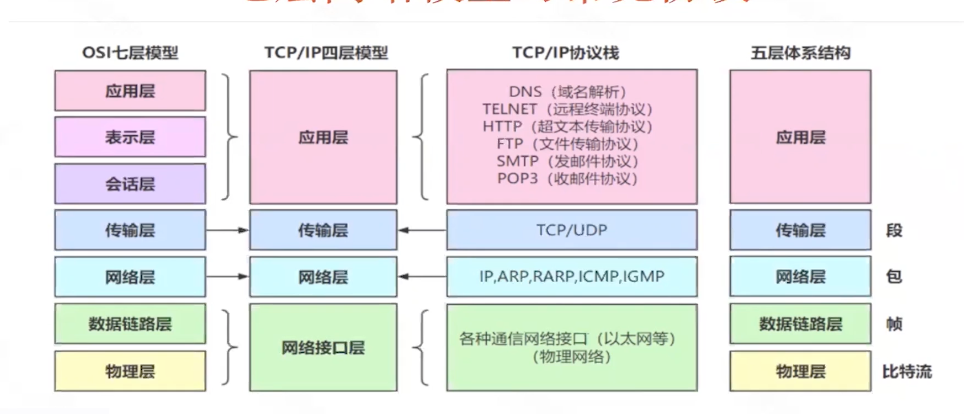
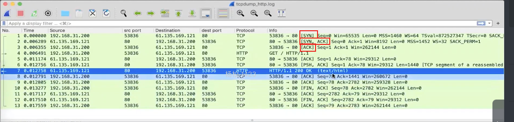
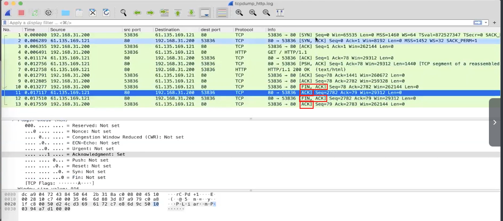
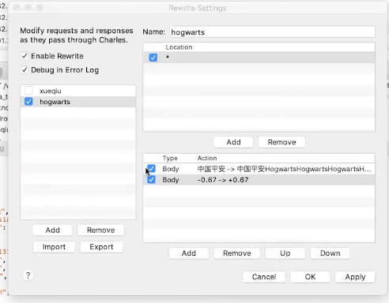
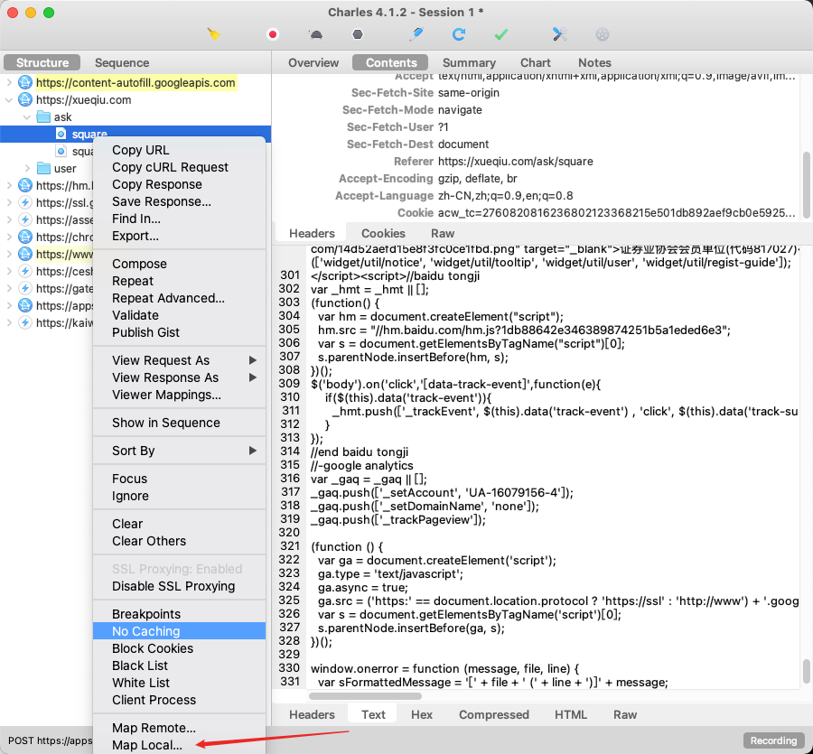
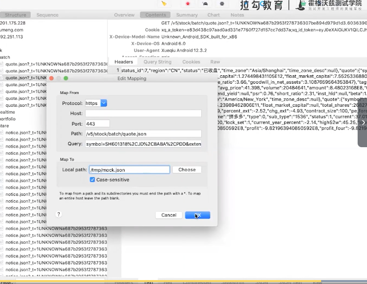

### 接口测试价值与体系
* 接口测试的必要性
    * 行业成熟方案
    * 更早的发现问题
    * 更快的质量反馈
    
* 接口测试不能取代UI测试
    * 接口测试虽然有很多优点，但是保证的是后端工程师的产出质量，不能解决移动端的质量
    * 大前端工程师的产出质量只能通过UI测试保证
    
    
* 大前端研发团队    
    * 前端工程师：HTML、JS、CSS 、Vue，React        
    * 移动开发工程师：Java、Kotlin
    * 跨端研发工程师：React Native、Flutter、Weex
    
* 后端研发团队：spring boot    
    
    
### 接口协议解析    
* TCP和UDP的区别    
   * TCP ：面向连接，错误重传、拥塞控制，适用于可靠性高的场景 
   * UDP：不需要提前建立连接，实现简单，适用于实时性高的场景 
* Restful 风格 Representational State Transfer    
    *  借助于http协议的基本请求方法代表资源的状态切换
    * post：新增或者更新
    * get:获取资源
    * put ：更新资源
    * delete：删除资源
    
* RPC协议    
    * RPC：Remote Procedure Call，以本地代码调用的方式实现远程执行    
    * Dubbo：
        * Java上的高性能RPC协议，Apache开源，由阿里捐赠
         底层应用层协议支持dubbo缺省tcp协议、http、hessian、thrift、grpc等
    
    * gRPC：
        * 高性能通用RPC框架，基于Protocol Buffers
        * PB是一个语言中立，平台中立的数据序列化框架。Google开源项目
    
    * Thrift：与grpc类似的多语言RPC框架，Apache开源
    
### 抓包分析TCP    

* 协议分析工具    
  * 网络监听：TCPDump+WireShark  
  * 代理Porxy  
    * 推荐工具：手动测试charles（全平台），安全测试burpsuite（全平台java）  
    * 自动化测试：mitmproxy
    * 其它代理：fiddler（仅windows），anyproxy（全平台）
    
* 协议客户端工具：curl、postman    
* tcpdump    
   * 参数 
    * -x 十六进制展示    
    * -w file 保存文件
   * 表达式 
     * ip tcp 协议   
     * host 主机名
     * port 80
     * src 来源 dst目的
     * and or（）逻辑表达式
    
* 实战    
> * sudo tcpdump host www.baidu.com -w /tmp/tcpdump.log
> * curl http://www.baidu.com
> * 停止tcpdump
> * 使用wireshark打开 /tmp/tcpdump.log    
    
* 三次握手    

* 四次挥手

     
    
### 使用Postman     
* 增加断言        
    * Tests 增加断言，右侧有预设模板
* 变量    
    * 环境变量与全局变量
    * 变量引用方法：{{variableName}}
* 添加cookie
    * Cookie 可以用来鉴权
    * Postman可以自动保存Cookie信息
* 参数传递    
    * 获取需要的值
    * 将获取到的值设置为环境变量
    * 在需要验证的接口中引用环境变量中保存的值
```
var jsonData = pm.response.json();
var token = jsonData.json.token;
pm.environment.set("token":token)
```    
    
* 用例集    
    * 选择环境变量
    * 选择执行次数
    * 选择延迟时间
    * 选择测试数据
    * 点击Run按钮即可开始执行
    
* 数据驱动   
    * csv
    * json
    
### cURL发送请求    
    
* Copy as curl 的作用    
    * 把浏览器发送的请求真实的还原出来
    * 附带了认证信息，所以可以脱离浏览器执行
    * 可以方便开发者重放请求、修改参数调试、编写脚本
*  客户端模拟请求工具    
    * nc tcp/udp 协议发送
    * curl 最常用的http请求工具    
    * postman 综合性的http协议测试工具
    * 代理工具、IDE工具，浏览器插件工具
    
* curl常见用法    
    * url = http://www.baidu.com
    * get请求 curl $url
    * post请求 curl -d 'xxx' $url
    * proxy使用 curl -x 'http://127.0.0.1:8080' $url    
    
* 重要参数    
    * -H "Content-Type:application/json" 消息头设置
    * -u username:password 用户认证
    * -d 要发送的post数据 @file 表示来自于文件
    * --data-urlencode 'page_size=50' 对内容进行url编码
    * -G 把data 数据当成get请求的参数发送，常与--data-urlencode结合使用
    * -o 写文件
    * -x 代理http代理 socks5 代理
    * -v verbose 打印更详细日志 -s 关闭一些提示输出
* curl '请求地址' | jq  get 请求加json解析    
    
### 常用代理工具        
* 代理工具：charles、burpsuite、fiddler、mitmproxy    
* 高性能代理服务器：squid、dante    
* 反向代理：Nginx    
* 流量转发与复制：em-proxy、gor、iptable、Nginx    
* socks5代理：ssh -d 参数    
* 使用nc简易演示代理实现    
    * mkfifo /tm/fifo
    * nc -lk 8080 < /tmp/fifo | sed -l -e 's/^Host.*/Host:site.baidu.com/' | tee -a /tmp/req.log | nc site.baidu.com 80 | tee -a /tmp/res>/tmp/fifo
*  优秀代理工具必备特性    
   * 代理功能：http/https、socks5     
   * 请求模拟工具： 拼装请求、重放请求、重复请求 
   * 网络环境模拟：限速、超时、返回异常 
   * mock：请求修改、响应修改 
   * fake：用测试环境替代真实环境 
* 推荐工具    
   * charles：开发、测试必备 
   * mitmproxy：测试开发工程师必备 
   * zap: 测试工程师安全测试工具     
   * burpsuite：黑客必备渗透测试工具 
   * fiddler：只有win，不推荐
   * postman：代理功能若，不推荐 
    
### Http/Https抓包分析    
* 配置代理   
* 获取证书    
* 安装证书       
* 信任证书    
* chrome 插件 switchyOmega 管理chrome代理    
* 获取证书 chls.pro/ssl    
    * 双击证书修改为始终信任    
* 所有系统的证书安装方式 https://ceshiren.com/t/topic/1105    
  * 安卓证书安装  
    * 配置代理
    * 访问 chls.pro/ssl    
    * 安装证书        
  * 安卓证书信任问题  
    * Android 6.0 默认用户级别的证书
    * Android 7.0以上需要修改apk包属性 <certificates src='user'>
    * https://developer/android.com/training/articles/security-config.html
    
* mock实践-数据修改    
    * tools-rewrite 功能 

    
* mock实战-数据加倍        
    *  复核文件到 vi /tmp/demo.json            

    * 复制raw变量 raw=$(cat /tmp/stock_demo)
    * 查看是否正确赋值 echo "$"
    * raw=$(echo "raw" | jq '.data.items+=.data.items' | jq '.data.items_size+=.data.items_size') 通过jq命令让json中的items和items_size自增
    * echo "$raw" > /tmp/mock.json 将翻倍的数据存起来
    * map local 
    

    * local path替换为造的数据     

* 使用总结    
     * rewrite ：简单mock     
     * map local:复杂mock       
     * map remote： 整体测试环境
    
### get、post区别 
   
* http的method字段不同
* post可以附加body，可以支持form、json、xml、binary等各种数据格式    
* 行业通用的规范    
    * 无状态变化的建议使用get
    * 数据的写入与状态修改建议使用post    
            
### Session、Cookie、Token区别    
    
* Session、Cookie区别    
    * cookie：浏览器接受服务器的Set-Cookie指令，并把cookie保存到电脑，每个网站保存的cookie只作用于自己的网站
    * session：数据存储到服务端，只把关联数据的一个加密串放到cookie中
    
* token应用场景    
    * 认证信息获取token，或者通过后台配置好token
    * 相关请求中使用token，多数以query参数的形态提供    
            
* session 与 token区别    
    * token是一个用户请求时附带的请求字段，用于验证身份和权限
    * session可以基于cookie，也可以基于query参数，用于关联用户相关数据
    * 跨端应用的时候，比如Android 原生系统不支持cookie
      * 需要用token识别用户
      * 需要用把sessionid保存到http请求中的header或者query字段中
    
### Mock        
            
#### Mock原理与实用场景
    
* 应用场景    
    * 第三方数据系统交互
    * 前后端数据交互
    * 硬件设备解耦
    
* 优点    
    * 不依赖第三方数据    
    * 节省工作量        
    * 节省联调
    
* 实现注意事项    
    * 了解通讯协议
    * 了解业务所需的交互数据
    
#### MapLocal    
* Tools-Map Local 使用本地修改后的Response替代返回        
    
#### chrome浏览器Switchomega插件    
    
#### Map Remote    
* 测试环境客户端通过charles连接生产环境验证    
    
#### mitmproxy    
    
* 安装： pip install mitmproxy    
   * 验证安装成功： mitmdump --version 
* mitmdump启动mitmproxy    
* Web端    
    * 新建Switchomega代理8080
    * 访问mitm.it 下载证书
    * 修改证书权限
    
* 手机端    
   * 修改手机代理配置为电脑ip，端口配置为mitmproxy默认端口8080 
   * 启动mitmdump 
   * 手机浏览器输入地址mitm.it，安装证书 
    
* mimtproxy 命令行形式    
* mimtweb 网页形式    
    
* mitmdump    
   * -s 参数，执行Python脚本 
   * -p参数，指定监听端口，默认监听8080 
   * 实例 mitmdump -p 8888 -s /Users/yangbo/Code/Hogwos/Hogwarts/9-1/mitm_a.py
    
```
class AD:
   def __init__(self):
      self.num = 0

   def request(self,flow):
      self.num += 1
      ctx.log.info(f"我们看到了{self.num}流水")

# mitmproxy插件addons需要添加实例化对象
addons = [
   AD()
]
```    
* mitmproxy 核心组件    
    * Addons（插件）
    * Events（事件）
   
* mitmdump dubug   
   
 ```
if __name__ == '__main__':

    from mitmproxy.tools.main import mitmdump
    # 使用debug模式启动mitmdump
    mitmdump(['-p', '8080', '-s', __file__])
```  
   
* mitmproxy remote   
   * 修改events事件response来mock
   
```
"""HTTP-specific events."""
import mitmproxy.http


class Events:
    def http_connect(self, flow: mitmproxy.http.HTTPFlow):
        """
            An HTTP CONNECT request was received. Setting a non 2xx response on
            the flow will return the response to the client abort the
            connection. CONNECT requests and responses do not generate the usual
            HTTP handler events. CONNECT requests are only valid in regular and
            upstream proxy modes.
        """
        pass

    def requestheaders(self, flow: mitmproxy.http.HTTPFlow):
        """
            HTTP request headers were successfully read. At this point, the body
            is empty.
        """
        pass

    def request(self, flow: mitmproxy.http.HTTPFlow):
        """
            The full HTTP request has been read.
        """
        pass

    def responseheaders(self, flow: mitmproxy.http.HTTPFlow):
        """
            HTTP response headers were successfully read. At this point, the body
            is empty.
        """
        pass

    def response(self, flow: mitmproxy.http.HTTPFlow):
        """
            The full HTTP response has been read.
        """
         if "xxxurl" in flow.request.url:
            flow.response.text = '{修改后的response}'


    def error(self, flow: mitmproxy.http.HTTPFlow):
        """
            An HTTP error has occurred, e.g. invalid server responses, or
            interrupted connections. This is distinct from a valid server HTTP
            error response, which is simply a response with an HTTP error code.
        """
        pass

addons = [Events()]
if __name__ == '__main__':

    from mitmproxy.tools.main import mitmdump
    # 使用debug模式启动mitmdump
    # __file__指当前文件
    # print(__file__)
    mitmdump(['-p', '8080', '-s', __file__])
```

* mitmproxy map local   
   
```
"""HTTP-specific events."""
import mitmproxy.http
from mitmproxy import http


class Events:
    def http_connect(self, flow: mitmproxy.http.HTTPFlow):
        """
            An HTTP CONNECT request was received. Setting a non 2xx response on
            the flow will return the response to the client abort the
            connection. CONNECT requests and responses do not generate the usual
            HTTP handler events. CONNECT requests are only valid in regular and
            upstream proxy modes.
        """
        pass

    def requestheaders(self, flow: mitmproxy.http.HTTPFlow):
        """
            HTTP request headers were successfully read. At this point, the body
            is empty.
        """
        pass

    def request(self, flow: mitmproxy.http.HTTPFlow):
        """
            The full HTTP request has been read.
        """
        print(flow.request.url)
        if "https://stock.xueqiu.com/v5/stock/batch/quote.json" in flow.request.url:
            with open('/Users/yangbo/Code/Hogwos/mock/xiuqiuhangqing.json', encoding="utf-8") as f:
                flow.response = http.HTTPResponse.make(
                    200,
                    f.read(), )

    def responseheaders(self, flow: mitmproxy.http.HTTPFlow):
        """
            HTTP response headers were successfully read. At this point, the body
            is empty.
        """
        pass

    def response(self, flow: mitmproxy.http.HTTPFlow):
        """
            The full HTTP response has been read.
        """

        pass


    def error(self, flow: mitmproxy.http.HTTPFlow):
        """
            An HTTP error has occurred, e.g. invalid server responses, or
            interrupted connections. This is distinct from a valid server HTTP
            error response, which is simply a response with an HTTP error code.
        """
        pass

addons = [Events()]
if __name__ == '__main__':

    from mitmproxy.tools.main import mitmdump
    # 使用debug模式启动mitmdump
    # __file__指当前文件
    # print(__file__)
    mitmdump(['-p', '8080', '-s', __file__])

```   
   
   
   
   
   
   
   
   
   
    